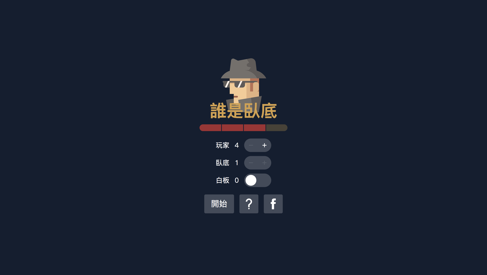

# Who is spy (誰是臥底)

## Screenshot


## Install

This project uses the following tools. Go check them out if you don't have them locally installed.
- [node](https://nodejs.org/en/) 
- [yarn](https://yarnpkg.com/en/docs/install) 
- [docker](https://docs.docker.com/compose/install/)

```
cp .env.example .env
docker-compose up -d
yarn install
yarn run migrate:up
```

## Usage

```
yarn dev
```

## Contributing

PRs accepted.

## License
